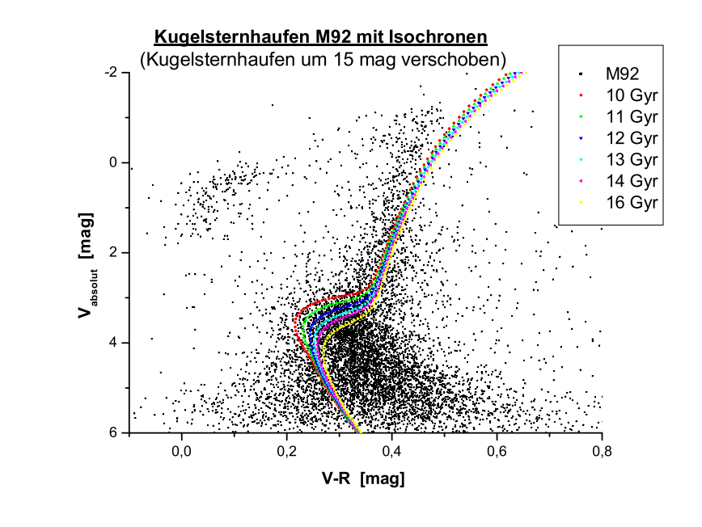
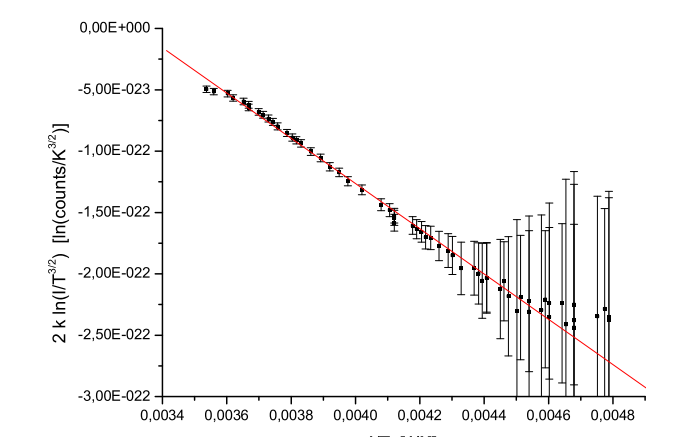
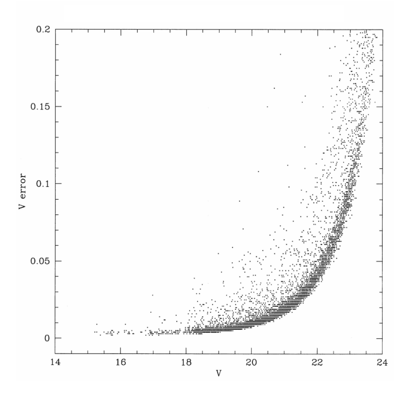

# Multichannel Data Analysis

8,000+ tabular records processed  
2 Data Channels · 25 Multi-Variable Reference Points · 8 Calibration Nodes  
Linux · SQL/Data Infrastructure · Pattern Recognition · Data Cleansing · Parameter Sweeps  

---

Statistical classification isolates structural patterns in unstructured source data.  
Iterative curve fitting yields data-driven baseline and variance estimations.  

High variance is observed within lower-intensity data segments.  

---

## Noise & Scaling Metrics

The system saturation threshold was identified at $\approx 60,000$ units.  
Mean scaling deviation was minimized to 0.56% across the full range.  

Output shifts depend entirely on digitalization parameters.  

---

## Gain Optimization

Variance-to-intensity scaling determines optimal digitalization parameters.  
The empirical conversion factor was calibrated precisely at $5.67 \pm 0.15$ units.  

Statistical metrics repeat consistently across independent validation runs.  

---

## Data Preparation

Tabular metrics were integrated and cleared of systemic bias per data frame.  
A master normalization matrix corrected local sensitivity variations.  
Coordinate mapping was executed via 2D clustering algorithms.  

Transformation matrices convert raw metrics to standardized target values.  

---

## Analytical Scope

The analysis evaluated dataset behavior across four operational dimensions:

- Operational temperature and baseline drift  
- Linear scaling thresholds and saturation  
- System gain and variance distribution  
- Density distribution anomalies and clustering  

---

## Source

Advanced Data Analysis & Experimental Lab Course (University of Heidelberg, 2006)  
Project Repository & Structural Dataset Archive
